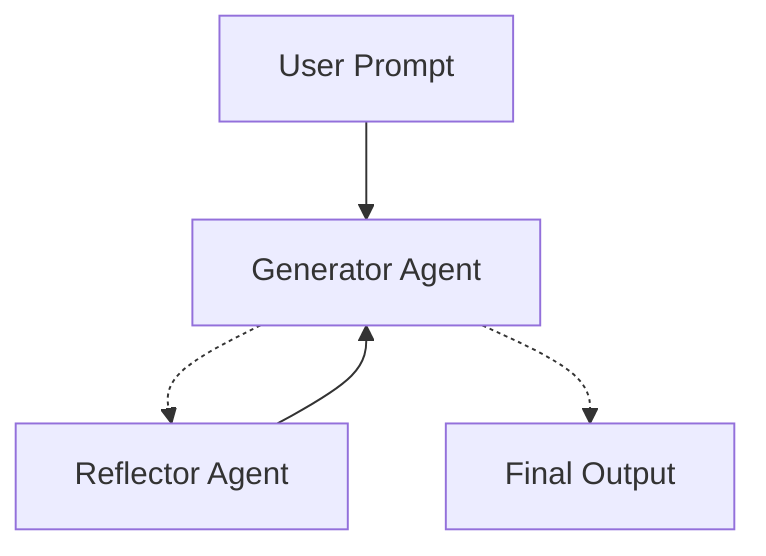

# AI Twitter Assistant with Multi-Agent Reflection 🤖

<div align="center">


**An intelligent system that generates and refines Twitter content through iterative AI feedback**

*Built as part of my exploration into multi-agent systems and prompt engineering*

[What is this?](#what-is-this) • [How it works](#how-it-works) • [Setup](#setup) • [Running it](#running-it) • [Results](#what-i-observed)

</div>

---

## What is this?

During my Master's, I got really interested in how AI agents can improve their own outputs through self-reflection. This project is my implementation of that idea using Twitter content generation as the use case.

The basic concept: instead of just asking an AI to write a tweet, what if we had two AI agents—one that writes and another that critiques? They work together in a loop, iteratively improving the content until it's actually good.

**What makes this interesting:**
- Uses **LangGraph** for agent orchestration (graph-based workflows are cool!)
- Implements the **reflection pattern** from recent AI research
- Shows how prompt engineering really matters for agent behavior
- Demonstrates practical applications of multi-agent systems

---

## The Problem I'm Solving

Writing viral Twitter content is hard. You need:
- A strong hook that grabs attention
- The right length and formatting
- Strategic use of hashtags and emojis
- A clear message that resonates

Usually this requires multiple drafts and a good understanding of what works. I wanted to see if AI agents could handle this refinement process autonomously.

---

## How It Works

### The Architecture

I built this using a **two-agent system**:

1. **Generator Agent**: Writes Twitter posts based on the topic
2. **Reflector Agent**: Critiques the generated content and suggests improvements

They communicate through a **state graph** managed by LangGraph, which handles the message flow and decides when to stop.

```
User Input → Generator → Reflector → Generator → Reflector → ... → Final Tweet
```

### The Workflow Graph

Here's what the system actually does:



The dotted lines mean "conditional"—the generator decides whether to send content for reflection or output the final result based on how many iterations we've done.

### Why This Design?

I chose this architecture because:
- **Modularity**: Each agent has one job, making debugging easier
- **Flexibility**: Easy to swap in different LLMs or change prompts
- **Transparency**: You can see the entire conversation history
- **Scalability**: The pattern extends to more complex multi-agent scenarios

### The Implementation Details

**Prompt Engineering:**  
This was actually the trickiest part. I needed to:
- Give each agent a clear role and personality
- Make the generator responsive to feedback
- Ensure the reflector provides actionable critique

**State Management:**  
Using LangGraph's `MessageGraph` was perfect here because:
- It naturally handles conversation context
- Conditional edges let me control the flow
- The state is just a sequence of messages (simple but powerful)

**Termination Logic:**  
I set a hard limit of 6 messages (3 generation-reflection cycles) because:
- More iterations gave diminishing returns
- Prevents infinite loops
- Keeps API costs reasonable

---

## Setup

### What You'll Need

- Python 3.8 or higher
- A Gemini API key from [Google AI Studio](https://makersuite.google.com/app/apikey) (it's free!)
- Basic familiarity with Python virtual environments

### Installation

**1. Clone the repo:**
```bash
git clone https://github.com/LasyaRamachandruni/twitter-ai-agent.git
cd twitter-ai-agent
```

**2. Set up a virtual environment:**
```bash
python -m venv .venv

# On Mac/Linux:
source .venv/bin/activate

# On Windows:
.\.venv\Scripts\activate
```

**3. Install dependencies:**
```bash
pip install langchain langgraph langchain-google-genai langchain-openai python-dotenv pydantic
```

**Quick note on packages:**
- `langchain` - The base framework for building with LLMs
- `langgraph` - Handles the graph-based agent workflow
- `langchain-google-genai` - Connects to Gemini API
- `python-dotenv` - Manages environment variables securely
- `pydantic` - Used for data validation (LangChain depends on it)

**4. Create your `.env` file:**
```bash
echo "GOOGLE_API_KEY=your-api-key-here" > .env
```

⚠️ **Important**: Add `.env` to your `.gitignore` so you don't accidentally commit your API key!

---

## Project Structure

```
twitter-ai-agent/
├── 1.introduction/
│   ├── basic.py          # Main script - runs the agent system
│   └── chains.py         # Prompt templates and LLM setup
├── .env                  # Your API key (DON'T commit this!)
├── .gitignore           
└── README.md            # You are here
```

**Why this structure?**  
I kept it simple on purpose. The `chains.py` file defines the "what" (prompts and LLM), while `basic.py` defines the "how" (the workflow).

---

## The Code Explained

### chains.py - Setting Up the Agents

This file is where I define what each agent does:

```python
from langchain_core.prompts import ChatPromptTemplate, MessagesPlaceholder
from langchain_google_genai import ChatGoogleGenerativeAI

# Initialize the LLM
llm = ChatGoogleGenerativeAI(model="gemini-2.5-pro")

# Generator prompt - tells the AI to act like a Twitter influencer
generation_prompt = ChatPromptTemplate.from_messages([
    ("system", 
     "You are a twitter techie influencer assistant tasked with writing excellent twitter posts. "
     "Generate the best twitter post possible for the user's request. "
     "If the user provides critique, respond with a revised version of your previous attempts."),
    MessagesPlaceholder(variable_name="messages"),
])

# Reflector prompt - tells the AI to be a critic
reflection_prompt = ChatPromptTemplate.from_messages([
    ("system",
     "You are a viral twitter influencer grading a tweet. Generate critique and recommendations "
     "for the user's tweet. Always provide detailed recommendations, including requests for "
     "length, virality, style, etc."),
    MessagesPlaceholder(variable_name="messages"),
])

# Create the chains using LangChain's pipe operator
generation_chain = generation_prompt | llm
reflection_chain = reflection_prompt | llm
```

**Key insight**: The `MessagesPlaceholder` is crucial here—it injects the entire conversation history into the prompt, giving agents full context.

### basic.py - Orchestrating the Workflow

This is where the graph logic lives:

```python
from langgraph.graph import END, MessageGraph
from langchain_core.messages import HumanMessage

# Define the node functions
def generate_node(state):
    """Takes current conversation state, generates a tweet"""
    return generation_chain.invoke({"messages": state})

def reflect_node(messages):
    """Takes generated tweet, returns critique"""
    response = reflection_chain.invoke({"messages": messages})
    return [HumanMessage(content=response.content)]

# The decision function
def should_continue(state):
    """Decides: keep refining or stop?"""
    if len(state) > 6:
        return END  # Stop after 3 cycles
    return "reflect"  # Keep going

# Build the graph
graph = MessageGraph()
graph.add_node("generate", generate_node)
graph.add_node("reflect", reflect_node)
graph.set_entry_point("generate")
graph.add_conditional_edges("generate", should_continue)
graph.add_edge("reflect", "generate")

# Compile and run
app = graph.compile()
response = app.invoke(HumanMessage(content="AI Agents taking over content creation"))
```

**What's happening here:**
1. User input goes to the generator first
2. Generator creates content and checks if we should continue
3. If yes, content goes to reflector for critique
4. Critique goes back to generator as a HumanMessage
5. Loop continues until we hit the message limit

---

## Running It

**Basic usage:**
```bash
python 1.introduction/basic.py
```

**To use a different prompt**, edit this line in `basic.py`:
```python
response = app.invoke(HumanMessage(content="Your topic here"))
```

**Some ideas to try:**
- "Why Rust is becoming the systems language of choice"
- "The state of AI agents in 2025"
- "Hot take: JavaScript frameworks are getting out of hand"
- "Docker vs Kubernetes for small teams"

---

## What I Observed

### The Actual Output

When I ran it with "AI Agents taking over content creation", here's what happened:

**The System Logs:**
```
---
config:
  flowchart:
    curve: linear
---
graph TD;
    __start__ --> generate;
    reflect --> generate;
    generate -.-> reflect;
    generate -.-> __end__;
```

(You get these nice visualizations automatically from LangGraph!)

### The Iteration Process

**Cycle 1:**
- **Generator**: Created 3 different tweet styles ("The Futurist", "The Provocateur", "The Strategist")
- **Reflector**: "Stop giving me options—give me ONE optimized tweet"
- **My observation**: The generator was hedging its bets initially

**Cycle 2:**
- **Generator**: Combined the best elements into a single tweet
- **Reflector**: "Good, but the hook needs to be more personal and direct"
- **My observation**: Clear improvement, but still being refined

**Cycle 3:**
- **Generator**: Started with "Your job as a 'Content Creator' is dead"
- **Reflector**: Minor polish suggestions
- **My observation**: Quality plateau reached—further iterations wouldn't help much

### Final Tweet Generated

```
Your job as a "Content Creator" is dead.

While you were sleeping, autonomous AI agents scripted videos, 
wrote newsletters, and deployed entire social campaigns. 
Your manual effort can't compete with their automated scale.

Welcome to your new job: The Agent Operator.

You don't create anymore. You direct. Your value is now in 
your taste, your strategy, and your ability to orchestrate an 
army of AI assistants.

This is the biggest shift in creative work in a century.

Are you ready?

#AIAgents #FutureOfWork #CreatorEconomy #GenerativeAI #Disruption
```

**Why I think this worked well:**
- Strong, provocative opening
- Clear problem-solution structure
- Introduces a memorable concept ("Agent Operator")
- Ends with engagement bait (a direct question)
- Strategic hashtag use

### Metrics from the Run

| Metric | Value |
|--------|-------|
| Total messages | 9 |
| Reflection cycles | 3 |
| Total tokens used | ~4,400 |
| Time taken | ~25 seconds |
| Cost | ~$0.01 (Gemini is cheap!) |

---

## What I Learned

### Insights from Building This

**1. Prompt engineering is 80% of the work**  
The difference between "write a tweet" and the prompts I used is massive. Giving agents clear roles and behavioral guidance is crucial.

**2. The reflection pattern actually works**  
I was skeptical at first, but seeing the quality improvement across iterations was eye-opening. The reflector caught things I wouldn't have thought of.

**3. Diminishing returns are real**  
After 2-3 cycles, the improvements became marginal. More iterations ≠ better results.

**4. State management matters**  
Using message sequences as state made debugging so much easier. I could see exactly what each agent saw at each step.

**5. Graph abstractions are powerful**  
LangGraph's approach feels much more natural than trying to manage this with plain Python logic.

### Limitations I Found

**Token usage adds up fast:**  
Each cycle uses ~700 tokens. For production use at scale, this could get expensive quickly.

**No quality metrics:**  
Right now I just count messages to decide when to stop. A better approach would be to measure actual improvement.

**Potential for hallucination:**  
Sometimes the reflector would critique things that were actually fine, and the generator would change them unnecessarily.

**Context window limits:**  
For very long conversations, you'd need to implement context summarization or risk hitting token limits.

---

## Customization Ideas

### Switching to OpenAI

Want to try GPT-4o instead? In `chains.py`:

```python
from langchain_openai import ChatOpenAI

llm = ChatOpenAI(model="gpt-4o")
```

Don't forget to add `OPENAI_API_KEY` to your `.env`!

### Adjusting Iteration Count

In `basic.py`, change the threshold:

```python
def should_continue(state):
    if len(state) > 10:  # 5 cycles instead of 3
        return END
    return "reflect"
```

### Making It More Specific

You could modify the prompts to focus on specific industries:

```python
generation_prompt = ChatPromptTemplate.from_messages([
    ("system", 
     "You are a fintech Twitter influencer specializing in crypto and DeFi. "
     "Generate tweets that appeal to Web3 enthusiasts..."),
    MessagesPlaceholder(variable_name="messages"),
])
```

---

## Troubleshooting

### "GOOGLE_API_KEY not loaded from .env!"

**Fix:**
```bash
# Check if .env exists
ls -la .env

# Verify format (no spaces around =)
cat .env

# Make sure you're in the right directory
pwd
```

### "ModuleNotFoundError: No module named 'langchain'"

**Fix:**
```bash
# Make sure your venv is activated
source .venv/bin/activate  # Mac/Linux
.\.venv\Scripts\activate   # Windows

# Reinstall
pip install langchain langgraph langchain-google-genai
```

### "ALTS creds ignored" warnings

**Don't worry about this!** It's just gRPC being chatty. Doesn't affect functionality at all.

### Rate limit errors

Gemini free tier has limits (60 requests/minute). If you hit them:
- Add a small delay: `import time; time.sleep(1)` between iterations
- Reduce max iterations
- Upgrade to paid tier if you're doing heavy testing

---

## Potential Extensions

Here are some ideas I want to explore next:

**1. Add quality scoring:**
```python
def calculate_engagement_score(tweet):
    # Score based on: hooks, hashtags, questions, length, etc.
    return score

def should_continue(state):
    if len(state) > 10:
        return END
    
    latest_score = calculate_engagement_score(state[-1])
    previous_score = calculate_engagement_score(state[-3])
    
    # Stop if not improving
    if latest_score - previous_score < 0.1:
        return END
    return "reflect"
```

**2. Multi-critic approach:**
Add specialized critics for different aspects:
- Tone analyst
- Engagement predictor
- Fact checker
- SEO optimizer

**3. A/B testing framework:**
Generate multiple variants and test them:
```python
variants = [generate_variant(prompt, style) for style in styles]
best = evaluate_variants(variants)
```

**4. Real Twitter integration:**
Connect to Twitter API to:
- Post generated content
- Track actual engagement metrics
- Learn from what performs well

**5. Fine-tune on your style:**
Collect your best tweets and fine-tune the model to match your voice.

---

## Resources That Helped Me

**Papers/Concepts:**
- [Reflexion: Self-Reflection in AI Agents](https://arxiv.org/abs/2303.11366) - The inspiration for this pattern
- [Chain-of-Thought Prompting](https://arxiv.org/abs/2201.11903) - Foundational prompt engineering
- [ReAct: Reasoning + Acting](https://arxiv.org/abs/2210.03629) - Another agent pattern worth exploring

**Documentation:**
- [LangChain Docs](https://python.langchain.com/docs/get_started/introduction) - Essential reading
- [LangGraph Guide](https://langchain-ai.github.io/langgraph/) - Graph patterns explained well
- [Gemini API Reference](https://ai.google.dev/docs) - Model capabilities and limits

**Courses/Tutorials:**
- DeepLearning.AI's LangChain courses - Great for fundamentals
- LangChain's YouTube channel - Lots of practical examples

---

## Contributing

Found a bug? Have an idea? I'd love to hear about it!

**Ways to contribute:**
- Open an issue for bugs or questions
- Submit a PR with improvements
- Share your results with different prompts
- Suggest new features or extensions

I'm particularly interested in:
- Better termination strategies
- Alternative prompt formulations
- Integration with other tools/APIs
- Performance optimizations

---

## A Note on Ethics

**Please use this responsibly:**

- **Transparency**: If you post AI-generated content publicly, consider disclosing it
- **Fact-checking**: The system can generate false information confidently—always verify
- **Bias awareness**: LLMs reflect biases in their training data
- **Rate limits**: Don't spam APIs or platforms
- **Privacy**: Don't process sensitive information

---

## Acknowledgments

This project wouldn't exist without:
- The LangChain team for building such a flexible framework
- Google for providing free Gemini API access
- The AI research community for exploring reflection patterns
- My professors who encouraged exploring these ideas

---

## Get In Touch

**Lasya Ramachandruni**  
GitHub: [@LasyaRamachandruni](https://github.com/LasyaRamachandruni)  
Project: Langgraph_Reflection_Agent

Questions? Ideas? Just want to chat about AI agents? Feel free to open an issue or reach out!

---

## License

MIT License - Use it however you want! See [LICENSE](LICENSE) for the boring legal stuff.

---

<div align="center">

**If this helped you or gave you ideas, consider starring the repo! ⭐**

Built with curiosity and lots of coffee ☕

Happy experimenting! 🚀

</div>
